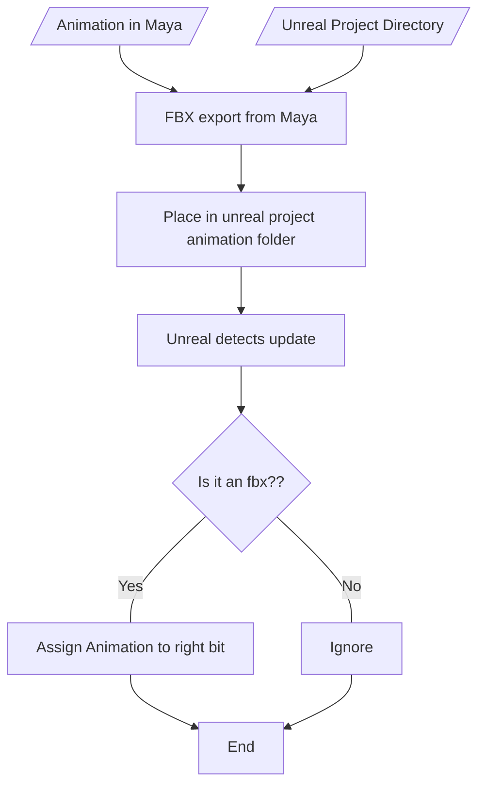

# Project Ideas

## Unreal animation pipeline

A "send this to unreal" button

What i need to do next!!

write Mesh, Camera, Light and Animation Data (bones?) to the .USDA

send it to unreal and make sure unreal knows that happens, then deal with unreal usd importing

https://nccastaff.bournemouth.ac.uk/jmacey/MastersProject/MSc24/07/masters_thesis_final.pdf

https://dev.epicgames.com/documentation/en-us/unreal-engine/python-api/?application_version=4.27

https://dev.epicgames.com/documentation/en-us/unreal-engine/scripting-the-unreal-editor-using-python

https://dev.epicgames.com/community/learning/tutorials/LnE7/unreal-engine-asset-import-export-using-unreal-python-api

https://www.youtube.com/watch?v=Ue5SyNc1nKg

https://www.youtube.com/watch?v=72n-UmfmepQ

https://www.youtube.com/watch?v=noNjWvMdOZY

https://www.artstation.com/blogs/deonwilson/bl7N/using-python-in-unreal-to-import-static-meshes

https://github.com/20tab/UnrealEnginePython/blob/master/tutorials/YourFirstAutomatedPipeline.md

https://developer.nvidia.com/usd/apinotes

https://openusd.org/docs/api/index.html

https://openusd.org/dev/api/index.html

https://www.youtube.com/watch?v=rA7LPiDkdJI

https://www.youtube.com/watch?v=S6NBc3oUlFk

https://forums.developer.nvidia.com/t/resources-from-the-learn-with-me-streaming-series/304680

https://help.autodesk.com/view/MAYAUL/2024/ENU/?guid=__CommandsPython_index_html

https://github.com/PixarAnimationStudios/OpenUSD?tab=readme-ov-file

