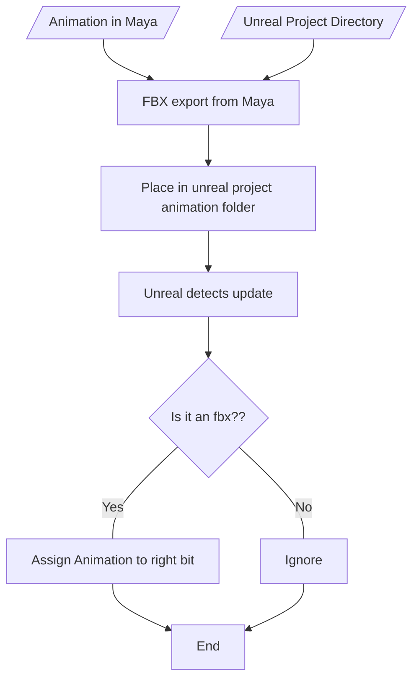

# Project Ideas

## Unreal animation pipeline

A "send this to unreal" button

So i've learned unreal has a cool python API that can automate a lot of the pain of importing and sequencing animations, and as part of my group project i'm the unreal guy with a bunch of animators, to save me and the one other person who knows unreal doing absolutely everything it'd be pretty handy to give them a "hey check out how this looks in unreal" button even if its not our specific project folder it just means they know it looks right.

So using the Maya API you can export things as an fbx with specific correct settings, since it'll have to be the same every time it'll mean no one can mess it up and have to do it multiple times, thats already a handy thing to have!

Then in unreal you can (apparently) check when the project recieves an update see whats been updated, so if its an fbx we just throw it in the right place and play about with it

simple???

im not sure if i'd get this done before we actually start animating for the game while simultainously making the game but it's still a better project idea than anything else i've comme up with

lets see if i can make this a flow chart

https://nccastaff.bournemouth.ac.uk/jmacey/MastersProject/MSc24/07/masters_thesis_final.pdf

https://dev.epicgames.com/documentation/en-us/unreal-engine/python-api/?application_version=4.27

https://dev.epicgames.com/documentation/en-us/unreal-engine/scripting-the-unreal-editor-using-python

https://dev.epicgames.com/community/learning/tutorials/LnE7/unreal-engine-asset-import-export-using-unreal-python-api

https://www.youtube.com/watch?v=Ue5SyNc1nKg

https://www.youtube.com/watch?v=72n-UmfmepQ

https://www.youtube.com/watch?v=noNjWvMdOZY

https://www.artstation.com/blogs/deonwilson/bl7N/using-python-in-unreal-to-import-static-meshes

https://github.com/20tab/UnrealEnginePython/blob/master/tutorials/YourFirstAutomatedPipeline.md

